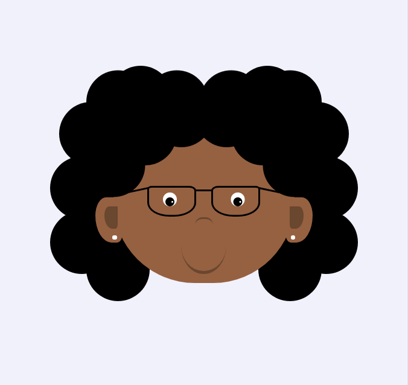

# Desenho - Mulher 
Projeto com a finalidade de treinar habilidades relativa a linguagem CSS.

## Layout
     
        
## Linguagens
* CSS
* HTML

## Executar
**Para executar este pojeto na sua máquina, siga as intruções:**
* execute o seguinte comando no seu terminal: 
``` $ git clone https://github.com/dhayananascimento/desenho-mulher.git```
* abra a pasta que será  criada
* abra o arquivo "index.html" com o navegador de sua preferência